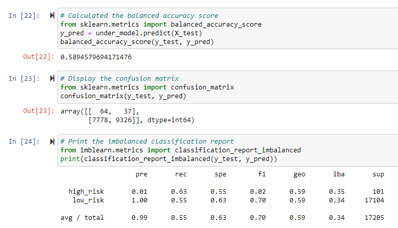

# Credit Risk Analysis

## Overview of the analysis: 
Using data from LendingClub, we will create and run Machine Learning modules to calculate Credit Risk in loan applications. We will use six machine learning modules to complete this analysis. They are split into two files credit_risk_resampling.ipynb and credit_risk_ensemble.ipynb. 

- Resources 
  - Pandas, Jupyter Notebook
  - LoanStats_2019Q1.csv 
  - scikit-learn and imbalanced-learn libraries

## Results: 
### Six learning modules

#### Sampling Modules:
**1. Naive Random Oversampling**
    - The Random Oversampling model "instances of the minority class are randomly selected and added to the training set until the majority and minority classes are balanced."
    
   - Balanced Accuracy Score: 0.6438627638488825
   - Precision: The precision is low for low risk and high for high risk loans.
   - Recall: high risk: .69/low risk: .59
    
    
 
 
**2. SMOTE Oversampling**
    - SMOTE stands for Synthetic Minority Oversampling Technique. It is where new values are created based on the proximity of minority values. 
    
   - Balanced Accuracy Score: 0.6628910844779521
   - Precision: The precision is low for low risk and high for high risk loans.
   - Recall: high risk: .63/low risk: .69
   
   
 
    
**3. Cluster Centroid Undersampling**
    - In Undersampling, the larger data is decreased to match the minority data. 
    
   - Balanced Accuracy Score: 0.6628910844779521
   - Precision: The precision is low for low risk and high for high risk loans.
   - Recall: high risk: .69/low risk: .59
    
   

  
    
**4. SMOTEENN (Combination Over and Undersampling)**
    - Combining SMOTE and ENN (Edit Nearest Neighbors algorithms, first you oversample with SMOTE and then clean the data using undersampling. Any outliers will be dropped. 
    
   - Balanced Accuracy Score: 0.6309698848743621
   - Precision: The precision is low for low risk and high for high risk loans.
   - Recall: high risk: .66/low risk: .60
    
    
 
    
#### Ensemble Classifiers:
**5. Balanced Random Forest Classifier**

   - Balanced Accuracy Score: 0.773197051931573
   - Precision: The precision is low for low risk and high for high risk loans.
   - Recall: high risk: .64/low risk: .90

  

**6. Easy Ensemble AdaBoost Classifier**
    - The model is trained and evaluated, then another model is trained using the knowlege from the previous model. Each model is built upon from the previous one. 
    
   - Balanced Accuracy Score: 0.9316600714093861
   - Precision: The precision is low for low risk and high for high risk loans.
   - Recall: high risk: .92/low risk: .94
   

## Summary: 
The Easy Ensemble ADaBoost Classifier had the highest recall scores out of all the models. It also had the highest accuracy score, at .931. Therefore, the Easy Ensemble AdaBoost Classifier is the best model to choose in determining credit risk. 
